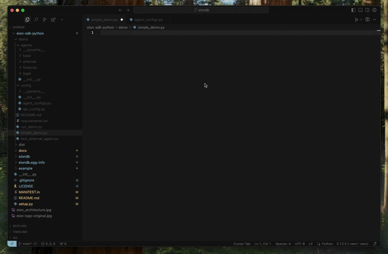

<div align="center">
  
  
  
  <h1 style="border-bottom: none; margin-bottom: 0;">Eion</h1>
  
  *Connecting AI agents through shared memory and collaborative intelligence.*

  
  [](https://www.gnu.org/licenses/agpl-3.0)
  
  [](https://discord.gg/mMNckGYVbq)

</div>

<div align="center">



</div>

&nbsp;

**Eion** is a shared memory storage that provides unified knowledge graph capabilities for multi-agent systems, adapting to different AI deployment scenarios from single LLM applications to complex multi-agency systems.

### 1. LLM Application
```
User ↔ LLM Application → Eion (context storage)
```

### 2. AI Agent Application  
```
Business Logic ↔ AI Agent → Eion (memory + knowledge graph)
```

### 3. Agency (Multi-Agent) Systems
#### 3a. Sequential Agency
```
Agent A → context → Agent B → context → Agent C
                ↓              ↓              ↓
              Eion ← shared memory & knowledge → Eion
```
#### 3b. Concurrent Live Agency (WIP)
```
Agent A ──┐
          ├── shared live context ← Eion (live sync + notifications)
Agent B ──┤
          │
Agent C ──┘
```

### 4. External Guest Agent Access
```
Internal Agency: Agent A ↔ Agent B → Eion ← External Agent C (guest)
                                            ↑
                                    (controlled access)
```

## Quick Start

### Prerequisites

- **Docker & Docker Compose**: For PostgreSQL and Neo4j
- **Go 1.21+**: For the Eion server
- **Python 3.13+**: For knowledge extraction services

### 1. Clone and Setup

```bash
git clone <repo>
cd eion
```

### 2. Start Database Services

```bash
# Start all required databases (PostgreSQL + Neo4j)
docker-compose up -d

# Verify databases are ready
docker-compose ps
```

### 3. Setup Database Extensions and Tables

```bash
# Enable the pgvector extension (required for embeddings)
docker exec eion_postgres psql -U eion -d eion -c "CREATE EXTENSION IF NOT EXISTS vector;"

# Run main orchestrator migrations (includes sessions table)
docker exec -i eion_postgres psql -U eion -d eion < database_setup.sql
```

### 4. Install Python Dependencies

```bash
# Create virtual environment
python3 -m venv .venv
source .venv/bin/activate  # On Windows: .venv\Scripts\activate

# Install dependencies
pip install -r requirements.txt
```

### 5. Build and Run Eion Server

```bash
# Build the server
go build -o eion-server ./cmd/eion-server

# Run the server
./eion-server
```

### 6. Verify Setup

```bash
# Check server health
curl http://localhost:8080/health

# Expected response:
# {"status":"healthy","timestamp":"2024-12-19T10:30:00Z","services":{"database":"healthy","embedding":"healthy"}}
```

### 7. Access the Register Console

Navigate to the Register Console for easy cluster management:

```
http://localhost:8080/console/
```

**⚠️ Important**: Include the trailing slash `/` in the URL.

#### Console Features

**Agent Registration Tab:**
- Simple form-based agent registration with automatic ID generation
- Support for different permission levels (read, read-write, full CRUD)
- Real-time registration status feedback
- View all registered agents in a table

**Monitoring Tab:**
- Real-time agent status and system monitoring
- View active sessions and users (coming soon)
- Refresh functionality for live updates

**Resources Tab:**
- Copy-paste ready HTTP API examples with your current configuration
- MCP integration snippets (when MCP is enabled)
- Quick start guide for developers
- Copy-to-clipboard functionality for easy integration

#### Using the Console

1. **Register an Agent:**
   - Go to "Register Agents" tab
   - Fill in name, description, and permissions
   - Click "Register Agent"
   - Agent appears in the table below

2. **Monitor Activity:**
   - Switch to "Monitoring" tab
   - View agent status and system health
   - Use refresh button for updates

3. **Get Integration Examples:**
   - Visit "Resources" tab
   - Copy HTTP API examples with your server details
   - Use MCP configuration if MCP is enabled

#### Configuration Display

The console automatically shows:
- Cluster API key for authentication
- Server host and port
- MCP and Numa integration status
- Neo4j connection details (when enabled)

#### Styling

The console uses Eion's brand colors:
- **Navy Blue** background with **Cream** text
- Responsive design for desktop and mobile
- Consistent with the main Eion website styling

## Architecture

Eion provides a unified API that combines:

- **Memory Storage**: PostgreSQL with pgvector for conversation history and semantic search
- **Knowledge Graph**: Neo4j with in-house extraction for temporal knowledge storage
- **Real Embeddings**: `all-MiniLM-L6-v2` model (384 dimensions) using sentence-transformers - production-ready embeddings
- **Knowledge Extraction**: In-house extraction service for entity/relationship extraction

## MCP Server Integration

Eion includes a built-in **Model Context Protocol (MCP) Server** that enables seamless agent integration through standardized tool interfaces.

### What MCP Provides

The MCP server exposes Eion's Session-level API as MCP tools, allowing AI agents to:
- Store and retrieve conversation memories
- Perform semantic search across stored conversations  
- Create and manage knowledge entries
- Search through extracted knowledge graphs

### Available MCP Tools

**Memory Tools (4):**
- `get_memory` - Retrieve conversation history with filters
- `add_memory` - Store new conversation messages
- `search_memory` - Semantic search in conversation history
- `delete_memory` - Remove conversation data

**Knowledge Tools (4):**
- `search_knowledge` - Find relevant extracted knowledge
- `create_knowledge` - Add new knowledge entries
- `update_knowledge` - Modify existing knowledge
- `delete_knowledge` - Remove knowledge entries

### Agent Integration

**Direct MCP Client (Recommended):**
```python
from mcp import ClientSession, StdioServerParameters
from mcp.client.stdio import stdio_client

# Connect to Eion MCP server
server_params = StdioServerParameters(
    command="python",
    args=["-m", "internal.mcp.server"],
    env={"EION_BASE_URL": "http://localhost:8080"}
)

async with stdio_client(server_params) as (read, write):
    async with ClientSession(read, write) as session:
        await session.initialize()
        
        # Use tools with agent credentials
        result = await session.call_tool("add_memory", {
            "session_id": "agent_session_123",
            "agent_id": "my_registered_agent",
            "user_id": "end_user_456",
            "messages": [{"role": "user", "content": "Hello!"}]
        })
```

**LangChain Integration:**
```python
from langchain_mcp_tools import convert_mcp_to_langchain_tools

mcp_servers = {
    "eion": {
        "command": "python", 
        "args": ["-m", "internal.mcp.server"],
        "env": {"EION_BASE_URL": "http://localhost:8080"}
    }
}

tools, cleanup = await convert_mcp_to_langchain_tools(mcp_servers)
# Use tools with LangChain agents
```

**Claude Desktop Integration:**
Add to `claude_desktop_config.json`:
```json
{
  "mcpServers": {
    "eion": {
      "command": "python",
      "args": ["-m", "internal.mcp.server"],
      "env": {"EION_BASE_URL": "http://localhost:8080"},
      "cwd": "/path/to/eion"
    }
  }
}
```

### Authentication

All MCP tools require agent authentication:
- `session_id` - Unique session identifier for the conversation
- `agent_id` - Registered agent ID (obtain via Developer API)
- `user_id` - End user ID that the agent serves

Agents must be registered via the Developer API before using MCP tools:
```bash
curl -X POST http://localhost:8080/cluster/v1/agents \
  -H "Content-Type: application/json" \
  -d '{"name": "My Agent", "capabilities": ["memory", "knowledge"]}'
```

### MCP Configuration

MCP server settings in `eion.yaml`:
```yaml
mcp:
  enabled: true                     # Enable MCP server
  port: 8081                        # MCP server port  
  python_path: ".venv/bin/python"   # Python executable path
  log_level: "INFO"                 # Logging level
  timeout: 30                       # Request timeout (seconds)
```

The MCP server is embedded within the Eion server process and requires no separate deployment.

## Configuration

Create `eion.yaml` (optional - defaults work out of the box):

```yaml
common:
  http:
    host: "0.0.0.0"
    port: 8080
  
  postgres:
    user: "eion"
    password: "eion_pass" 
    host: "localhost"
    port: 5432
    database: "eion"
  
  # Neo4j Configuration (Required)
  numa:
    neo4j:
      uri: "bolt://localhost:7687"
      username: "neo4j"
      password: "password"
      database: "neo4j"

# MCP Server Configuration (Optional)
mcp:
  enabled: true                     # Enable MCP server
  port: 8081                        # MCP server port
  python_path: ".venv/bin/python"   # Path to Python executable
  log_level: "INFO"                 # MCP server log level
  timeout: 30                       # Request timeout in seconds

# Register Console Configuration (Optional)
console:
  enabled: true                     # Enable Register Console (default: true)
```

## Additional Configuration

For production deployments, you may want to customize the database settings in `docker-compose.yml` or create your own configuration.

Or use the automated setup script:

```bash
# One-command setup (includes database startup, Python env, and server build)
./setup.sh

# Then start the server
./eion-server
```
---
<div align="center">
  
  
</div>