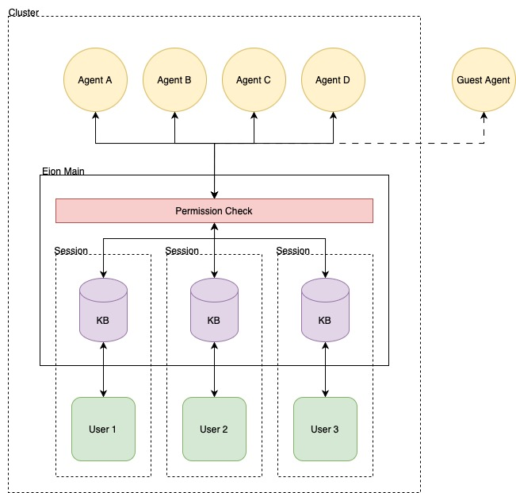

# Eion Implementation Plan

## "Google Docs of Agents"
- Multiple AI agents to share knowledge through sessions
- External guest agent access with developer-controlled whitelist
- Comprehensive permission system with group-based access control
- Real-time conflict detection and resolution for sequential workflows
- Complete monitoring and analytics for agent performance insights
- Production-ready architecture suitable for open-source release

## Tech Spec
### Database Layer
- **PostgreSQL**: Agents, groups, sessions, permissions, interaction logs
- **Neo4j**: Knowledge graph with temporal relationships and agent metadata
- **Schema Management**: Complete `database_setup.sql` with migrations

### Core Services
- **Orchestrator**: Agent management, permissions, conflict resolution
- **Memory Service**: Session-based memory storage with semantic search
- **Knowledge Service**: Fact extraction and graph storage
- **Monitoring Service**: Analytics and collaboration insights

### SDK Integration
- **Python SDK**: Complete agent client library
- **Authentication**: Bearer token validation
- **Error Handling**: Comprehensive error responses and logging

## Future Improvements
### 1. Performance Optimization
- **Query & Database Optimization**: Optimized database queries for multi-agent operations, efficient conflict detection algorithms, and database query performance optimization for analytics
- **Connection & Load Management**: Connection pooling for agent clients, load balancing for agent requests, and latency optimization for sequential agent handoffs
- **Caching & Monitoring**: Caching strategies for frequently accessed knowledge, memory and CPU usage monitoring for agent operations
- **Analytics & Scoring**: Agent response time analysis, session throughput measurements, knowledge quality metrics, agent efficiency scoring and optimization recommendations

### 2. Security & Compliance
- **Audit & Logging**: Comprehensive audit logging for all external access and agent operations, compliance reporting for regulatory requirements
- **Data Protection**: End-to-end encryption for cross-agency communications, privacy impact assessments, zero-trust security model for external access
- **Enterprise Security**: Multi-tenant agent isolation, security hardening for agent authentication, real-time external usage monitoring and rate limiting
- **Disaster Recovery**: Backup and disaster recovery for inter-agency collaboration data and shared knowledge
- **Regulatory Compliance**: Integration with government audit systems, inter-agency data sharing regulatory compliance

### 3. Wide Integration (MCP, Cloud, SDK)

### 4. Live Agency
#### 4a. Permission & Access Control Systems
- **Dynamic Permissions**: Temporary permissions with expiration/scheduling, dynamic permissions based on agent actions and state, fact-specific and memory-specific permissions beyond session-level
- **Role Management**: Complex role hierarchies with delegation and inheritance, agent permissions inherit from space/role templates with hierarchy support
- **External Access**: Approved external agents get temporary scoped access to knowledge spaces, automatic expiration and cleanup of expired grants, manual revocation capabilities
- **Workflow Controls**: Exchange initiation and approval workflows, enterprise-grade permission control for complex concurrent agent scenarios

#### 4b. Multi-Agency Collaboration
- **Shared Spaces**: Temporary joint knowledge spaces with expiration for real-time multi-agency agent collaboration
- **Cross-Agency Operations**: Shared fact correlation and knowledge graph traversal, live collaboration between agencies (e.g., DMV and IRS) on shared cases

#### 4c. Real-Time Conflict Detection & Resolution
- **Rules Engine**: Collaboration Rules Engine for complex approval workflows ("Agent A can edit facts created by Agent B only after Agent C approves")
- **Resource Management**: Agent-owned resources with complex delegation, agents validate/approve each other's changes, elevated permission request chains
- **Organizational Structure**: Agent hierarchy and supervisor relationships, concurrent collaboration policies for real-time multi-agent editing
- **Real-Time Infrastructure**: 
  - Redis Streams for knowledge update broadcasting with selective agent subscriptions
  - Connection heartbeat and presence tracking with session recovery
  - Event-driven state updates for immediate delta updates to live agents
- **Conflict Handling**: 
  - Optimistic locking for live agents editing same resources
  - Vector clocks for complex causality tracking
  - Concurrent write detection and live conflict notifications
  - CRDT foundation preparation for conflict-free data types

### 5. Numa+ (Advanced AI Features)
- **Collaborative Editing**: CRDT for collaborative fact editing, operational transformation for text-based memories, semantic merging for knowledge graph updates
- **Intelligent Resolution**: Automatic conflict resolution without manual intervention, semantic analysis of conflicting updates, intent-based conflict resolution
- **Learning Systems**: Learning from previous conflict resolutions, agent preference learning for resolution strategies
- **Cross-Agency AI**: AI-powered knowledge correlation across agencies, automated compliance and redaction systems, predictive analytics for inter-agency collaboration, advanced threat detection across agency boundaries

---

  
  

